# Simple Mode QA pass (2026-09-16): keep/kill evidence

**Scope:** live, first-time-user walkthrough of `AppSetting.mode == "simple"` on a
disposable local preview (the same mechanism `visual_review` uses —
`start_preview`/`stop_preview` against a throwaway SQLite dev database, never
the shared production database). No code was changed as part of this Job;
this document is the deliverable.

**Bottom line up front:** Simple Mode is real on exactly one screen (the
Jobs dashboard) and a thin slice of the notification pipeline. Every other
screen a first-time user is one click away from — onboarding's own mode
picker, the "New Feature" button, the Epic detail page it lands on, the
Repository detail page, the system-readiness panel on the dashboard itself,
and the entire primary sidebar nav below "Repositories" — is either
completely unmodified advanced-mode UI, or actively broken. See
**Recommendation** at the end.

## Setup

```
start_preview                                   # disposable dev SQLite DB, no prod access
AppSetting.current.update!(mode: "simple")      # in the preview process only
```

Seed data (`db/seeds.rb`) already provides an admin user
(`demo@syrus.local`) with a connected repository (`demo/syrus-preview`) and
some fixture Jobs/Epics. To see the true first-run experience I also created
a second, non-admin user (`newbie@syrus.local`, `global_role: "user"`, no
repositories, no chat history) directly in the console, since the seeded
account is both an admin and already past onboarding.

## Walkthrough log

### 1. Onboarding as a non-admin, non-technical user

Signed in as `newbie@syrus.local`. Landed on `/onboarding` immediately (no
signup flow exists — `AppSetting.signups_open?` is `false` by default, so a
brand-new non-technical user can't even get an account without an admin
inviting them first; not a Simple Mode issue, but worth naming since the
persona this mode targets is the least likely to have an invite already).

The setup checklist's first item already flags the problem:

> **Account and admin access** — Ask an admin to grant access before
> configuring shared setup.

but the very next item is a **global, instance-wide** mode toggle presented
as a personal onboarding question:

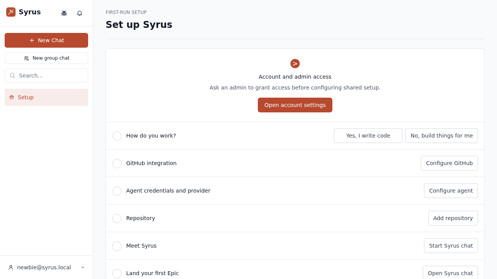

Clicking **"No, build things for me"** as this non-admin user does nothing
visible — no error toast, no state change, checkbox stays empty. The network
console shows why:

```
[ERROR] Failed to load resource: the server responded with a status of 403 (Forbidden)
  @ http://localhost:3001/api/v1/app/admin/settings:0
```

- `app/frontend/routes/Onboarding.tsx:74` calls `updateAdminSettings({ mode: selectedMode })`
  for every signed-in user reaching this step, regardless of role.
- `app/controllers/api/v1/app/admin/settings_controller.rb` handles that
  request; its parent `app/controllers/api/v1/app/admin/base_controller.rb:6`
  runs `before_action :require_admin`, so a non-admin gets a bare 403.
- The onboarding wizard swallows the failure completely: no toast, no
  inline error, the button just looks unresponsive.

**Bug:** the one onboarding step that is *supposed to be* the Simple Mode
opt-in is unusable by anyone except an instance admin, with a silent failure
that gives a non-technical first-time user zero feedback about why nothing
happened. This is also a structural mismatch: `AppSetting#mode` is a
singleton, instance-wide row (`app/models/app_setting.rb:39-47`,
`AppSetting.current`), but it's wired into a *per-user* onboarding
checklist item. On a multi-user instance, whichever admin happens to click
through onboarding last decides the mode for every other user — there's no
per-user "I'm non-technical" preference, only one global switch dressed up
as a personal one.

Continued down the same checklist as this user:

- **GitHub integration** → a modal titled "GitHub integration" instructing
  the user to generate a **classic GitHub Personal Access Token** with the
  `repo` and `workflow` scopes, paste it in, then continue to registering a
  **GitHub App**:

  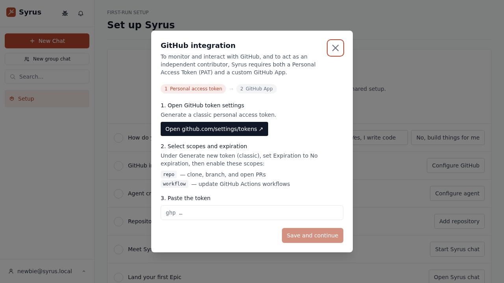

  This is unavoidable — Syrus is a GitHub automation tool and has to
  authenticate somehow — but it is squarely aimed at someone comfortable with
  developer settings pages, scopes, and classic vs. fine-grained tokens.
  "No, build things for me" doesn't change a word of this copy.

- **Repository** → correctly disabled until GitHub is configured, with a
  clear inline error ("No GitHub token configured yet — revisit Configure
  GitHub first."):

  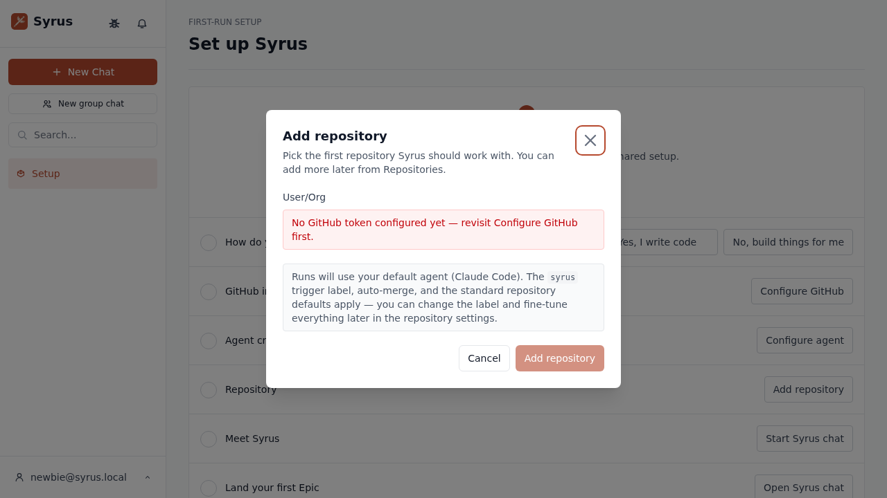

  This part is a legitimately well-guarded step — noted here as one of the
  things that *does* work, for balance.

### 2. Signing in as the admin (with a repo already connected)

Switched to `demo@syrus.local` (admin, repo attached). Despite having GitHub
+ repository already configured, this account is *also* dropped onto
`/onboarding` on sign-in — the root redirect in `app/frontend/routes/App.tsx:220-221`
gates on `!setup.first_epic_landed && !setup.onboarding_chat_started`, not
on whether setup is actually complete. Direct navigation to
`/dashboard/jobs` works fine, so this is only a `/` root-redirect quirk, not
a hard block — but it means a returning admin who hasn't yet "landed" a
feature keeps getting funneled back to the onboarding checklist instead of
their work. Low severity, worth a mention.

### 3. The dashboard ("Your work") — the one screen where Simple Mode is real

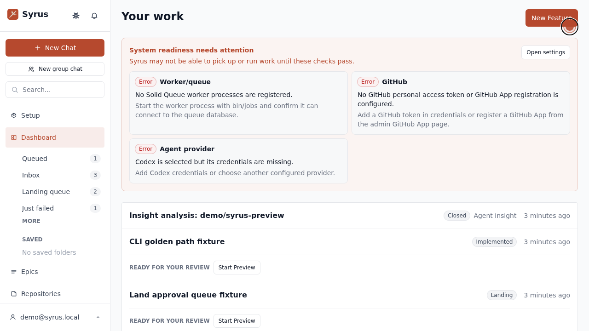

Good parts, confirmed live:

- Every Job is listed as a flat row with its own status pill and a
  "Ready for your review" / "Start Preview" action when applicable — no
  Workflow/Step/Run vocabulary, matching `app/services/app/dashboard_payload.rb:211-234`.
- Job titles are **not** links (confirmed both in the live DOM and in
  `app/frontend/routes/Dashboard.simple.test.tsx:26`,
  `expect(screen.queryByRole("link", {...})).not.toBeInTheDocument()`), and
  `/jobs`, `/jobs/new`, `/jobs/:id`, `/jobs/:id/source` all hard-redirect to
  `/dashboard/jobs` (`app/frontend/routes/App.tsx:471-478`, confirmed live
  by navigating directly to `/jobs/1`). Jobs/Workflows as a concept really is
  gone from this screen.

Bad part, also on this same screen, unconditionally: the **System
readiness** panel. `app/frontend/routes/Dashboard.tsx:247-267`
(`ReadinessPanel`) renders whenever `readiness.status !== "ok"`, with no
Simple Mode check at all, and the check messages come straight from
`app/services/app_api/readiness_checks.rb` verbatim:

- `worker_queue_check` (readiness_checks.rb:73-92): *"No Solid Queue worker
  processes are registered." / "Start the worker process with `bin/jobs`..."*
- `github_check` (readiness_checks.rb:138-179): *"No GitHub personal access
  token or GitHub App registration is configured." / "...register a GitHub
  App from the admin GitHub App page."*
- `agent_provider_check` (readiness_checks.rb:181-202): *"Codex is selected
  but its credentials are missing."*

A non-technical user's very first screen after "No, build things for me"
tells them to start a worker process with a shell command and register a
GitHub App from an admin page. There is no Simple Mode rewrite of this copy
anywhere — it's the identical panel an operator would see.

### 4. "New Feature" → an unmodified "New Epic" form, including a raw GitHub issue URL field

Clicked the dashboard's **New Feature** button (`/epics/new`):

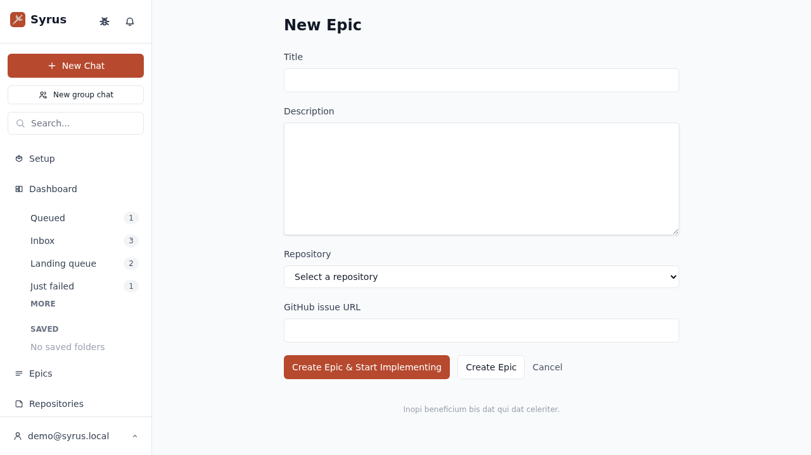

`app/frontend/routes/EpicForm.tsx` has no Simple Mode branch at all —
`grep -n simple app/frontend/routes/EpicForm.tsx` returns nothing. Line 79
renders `t("new_epic")` unconditionally (`app/frontend/i18n/locales/en/epics.json:99`
→ `"New Epic"`), and line 117 renders a raw `t("github_issue_url")` field
(`epics.json:105` → `"GitHub issue URL"`) with no explanation of what a
GitHub issue is or how to get a URL for one. The button that got the user
here was branded "New Feature"; the page it opens says "New Epic" in the
browser tab, the page heading, and the field labels. Nothing was reworded
for the audience this mode is supposedly built for.

### 5. The Epic detail page tells you your brand-new feature is old

Filled in the form ("Add a contact form to the website") and submitted.
Landed on `/epics/2` — a feature I had created seconds earlier:

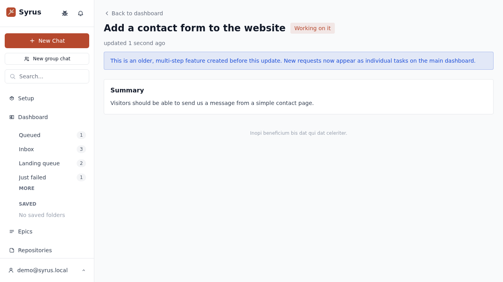

> **This is an older, multi-step feature created before this update. New
> requests now appear as individual tasks on the main dashboard.**

This is a real bug, not a copy nit. `app/frontend/routes/EpicDetail.tsx:139-156`
renders this banner (`t("legacy_epic_banner")`,
`app/frontend/i18n/locales/en/epics.json:3`) for **every** Epic viewed in
Simple Mode, unconditionally — there's no check against the Epic's creation
date or any "is this legacy" flag. The text is only true for Epics that
predate some past product change; it is factually false for an Epic the
user just created via the dashboard's own primary CTA. The net effect: the
one "feature" creation flow Simple Mode still exposes immediately tells the
user their new feature is a deprecated relic and to go create tasks
elsewhere instead — on the page whose entire job is to *be* that creation
flow. If Simple Mode's real intended flow is "individual Jobs on the
dashboard, no more Epics," then the dashboard's "New Feature" button
pointing at `/epics/new` at all is the bug; either way, this loop is broken
today.

I did not find any UI, in Simple Mode or otherwise, for adding a child Job
to an Epic from this form/detail page — no "add a task" affordance exists
here. Whatever produces the "strict linear chain of child Jobs" CLAUDE.md
describes for Simple Mode Epics must come from the chat-driven
`propose_epic_with_jobs` path, not this web form; I did not have a way to
exercise real chat + a real agent run in this sandboxed preview (no GitHub
credentials, no worker process — see readiness panel above), so that part of
the design is verified by code only:

- `app/models/job.rb:1899-1905` (`apply_simple_epic_automation_defaults`)
  and `:1907-1914` (`ensure_simple_epic_auto_approval`) both gate on
  `AppSetting.simple?` and `repository&.auto_merge_enabled?`, and
  `app/models/repository.rb:23` confirms `auto_merge_enabled` defaults to
  `false` — matching CLAUDE.md's claim that Simple Mode auto-land is
  per-repository opt-in, not automatic everywhere. This part of the design
  reads correctly; I just couldn't drive an actual agent run end-to-end in
  this environment to watch it happen.

### 6. The Repository detail page is 100% advanced-mode, unconditionally

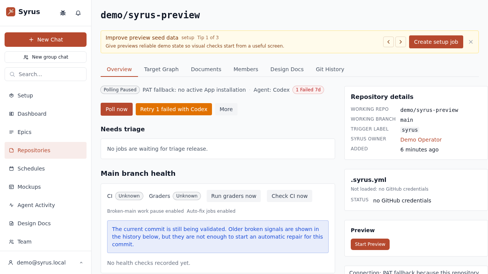

Every element on this page is raw operator vocabulary: tabs for **Target
Graph**, **Documents**, **Members**, **Design Docs**, **Git History**; status
chips for "PAT fallback: no active App installation", "Agent: Codex",
"1 Failed 7d"; buttons "Poll now" / "Retry 1 failed with Codex" / "Run
graders now" / "Check CI now"; a "Needs triage" section; "Broken-main work
pause enabled" / "Auto-fix jobs enabled"; a right rail with "TRIGGER LABEL"
and raw `.syrus.yml` load status. Grepping
`app/frontend/routes/RepositoryDetail.tsx` for `simple` turns up exactly two
lines in the whole file: line 427 (`payload.simple_mode ? null : <Link ...
new_job_path>`, hiding the "New Job" button) and line 601 (another single
`if (payload.simple_mode) return null`). Everything else on this page — the
majority of it — ships to a Simple Mode user exactly as an admin sees it.

### 7. The rest of the primary sidebar nav: no Simple Mode filter exists for plugin pages at all

With the demo admin account, the primary sidebar (below Dashboard/
Repositories) showed: **Epics, Repositories, Schedules, Mockups, Agent
Activity, Design Docs, Team, Spending** — the full advanced-mode nav, not a
trimmed one:

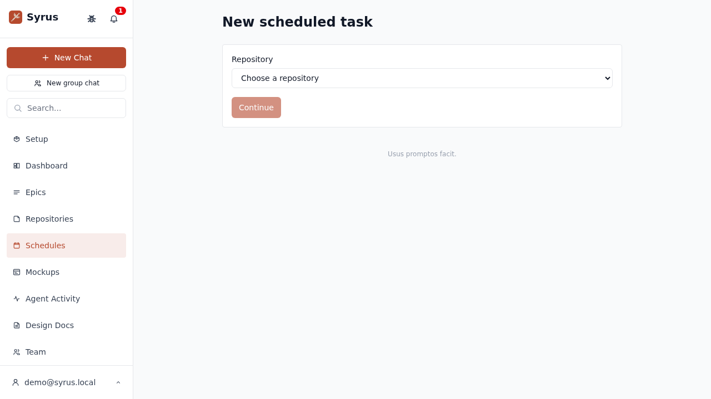

"Epics" here is intentional legacy support — `app/frontend/routes/AppChromeV2.tsx:107`
computes `legacyEpicsVisible = simpleMode && Boolean(data?.app?.legacy_epics_visible)`
specifically so pre-existing Epics remain reachable, paired with
`LegacyEpicsBanner` (`app/frontend/routes/Dashboard.tsx:437`) explaining
they're old and to use the main dashboard instead. That part is deliberate
and reasonably done.

**Schedules is not.** CLAUDE.md and the issue both state scheduled tasks are
"hidden from the UI" in Simple Mode. Live reproduction says otherwise —
clicking "Schedules" reaches a fully working CRUD page, and "New scheduled
task" opens without any gate:

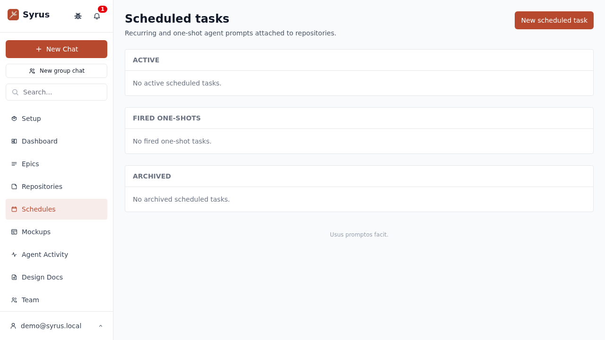

The root cause is a gap between two layers that both need to agree and only
one does:

- `plugins/scheduled_tasks/app/services/scheduled_tasks/repo_page_tabs.rb`
  **does** gate correctly — `return [] if AppSetting.simple?` — so the
  per-repository "Scheduled Tasks" tab is correctly hidden (confirmed live:
  the repository page's tab list has no such tab).
- `plugins/scheduled_tasks/app/services/scheduled_tasks/sidebar_pages.rb`
  has **no such gate** — it unconditionally registers the global "Schedules"
  and "Schedule templates" sidebar pages.
- Nothing downstream compensates. `app/services/app/sidebar_pages_payload.rb`
  serializes every plugin's `sidebar_pages` with no mode filter, and
  `app/frontend/routes/appChromeV2/sidebarNav.tsx`'s `buildSidebarNavItems`
  filters `coreItems` by `item.visible?.(context)` (line 71) but maps
  `pluginItems` straight through with **no filter at all** (lines 82-95).

That last point generalizes past Schedules: **no plugin-provided sidebar
page is ever hidden in Simple Mode**, because the merge function that
combines core nav items with plugin nav items only has a visibility hook for
the core half. Mockups, Agent Activity, Design Docs, Team, and Spending are
all reachable the same way, for the same structural reason — I didn't audit
every one of those pages' own content for "is this appropriate to show a
non-technical user," but the fact that the *nav entry itself* is unfiltered
holds for all of them, and CLAUDE.md's explicit claim about scheduled tasks
specifically is verifiably false as of this build.

For contrast, the **GitHub Issues repo tab** *is* implemented correctly
(`plugins/github_source/app/services/github_source/repo_page_tabs.rb:6`,
`return [] if AppSetting.simple?`) — I confirmed live that navigating
directly to `/repositories/1/plugin/issues` in Simple Mode renders "Page
unavailable" rather than the issues list:

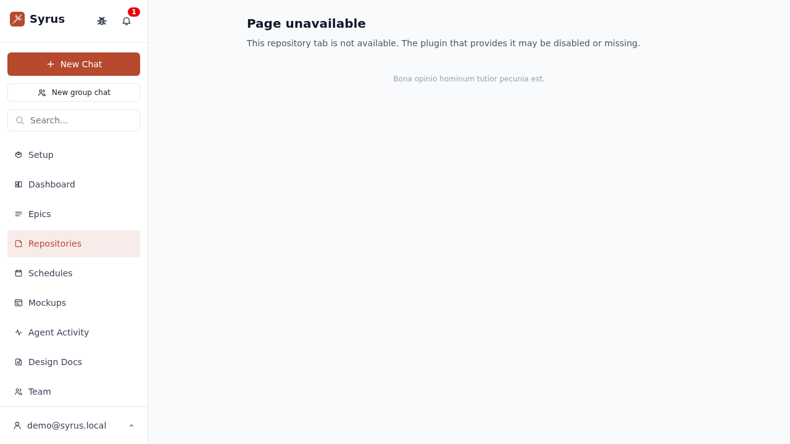

So the pattern is inconsistent rather than uniformly broken: repo-scoped
plugin *tabs* get checked case-by-case (some right, some — were there any —
could be missed), while every plugin *sidebar page* is structurally exempt
from the check regardless of what any individual plugin author intended.

### 8. Notification suppression — this part works

Verified `NotificationService` directly against the preview's Job data
(`app/services/notification_service.rb`):

- A `job_failed` notification for a Job that belongs to an Epic was
  suppressed, per `SIMPLE_JOB_CENTRIC_KINDS`/`simple_job_centric?` routing
  epic-child failures through the epic-level rollup instead.
- A `job_failed` notification for a genuinely standalone Job (`epic_id:
  nil`) was **not** suppressed, appeared in the bell with unread count "1",
  and rendered with clean, job-centric copy:

  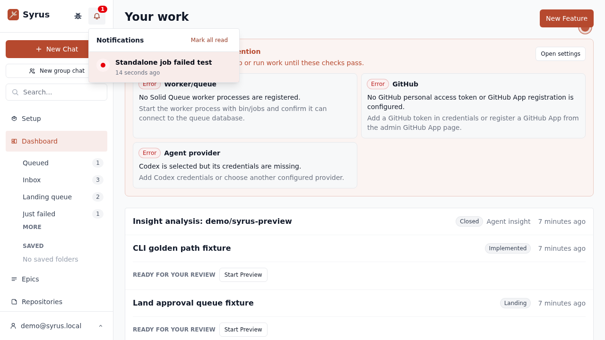

- A `pr_merged` notification (in `SIMPLE_SUPPRESSED_KINDS` unconditionally)
  was suppressed as expected.

This matches CLAUDE.md's description exactly and is the most solid piece of
Simple-Mode-specific engineering I found in this pass.

### 9. A failed Job is a dead end

The seed data includes a Job in `failed` state ("Repair seeded background
workflow"). In Simple Mode there is no click-through to it (see §3 — no
Job detail route exists at all), no inline error summary on the dashboard
row, and no retry action surfaced — just the bare word "failed" next to a
timestamp. An advanced-mode user in the same situation can open
`/jobs/:id` and see the failure classification, logs, and a retry action;
a Simple Mode user has no path to any of that. This isn't a bug in the
sense of contradicting a design doc, but it's a real gap for the persona
Simple Mode targets: the one moment they most need help (something broke)
is the one moment the simplified UI gives them nothing to act on.

## Summary of findings

| # | Surface | What CLAUDE.md/the issue claims | What actually happens | Severity |
|---|---|---|---|---|
| 1 | Onboarding mode picker | Lets a user choose Simple vs. Advanced | 403s silently for any non-admin (`Onboarding.tsx:74`, `admin/base_controller.rb:6`); a global singleton setting is framed as a personal choice | High |
| 2 | GitHub integration step | — | Requires generating a classic PAT with `repo`/`workflow` scopes and/or a GitHub App; unavoidable but not simplified for this audience | Medium (inherent to the product, but undermines "non-technical" framing) |
| 3 | Dashboard system readiness panel | — | Unconditionally shows raw ops errors ("Solid Queue worker", "bin/jobs", "GitHub App registration") on the primary Simple Mode screen (`Dashboard.tsx:247-267`, `readiness_checks.rb`) | High |
| 4 | "New Feature" → Epic form | "Epics are presented as features" | Page titled "New Epic", raw "GitHub issue URL" field, zero Simple Mode branching (`EpicForm.tsx`) | High |
| 5 | Epic detail page | "Epics are presented as features" | Every Epic, including one created seconds ago, is shown a hard-coded "this is an older feature" banner (`EpicDetail.tsx:139-156`, `epics.json:3`) — factually wrong, and contradicts its own creation flow | High (real bug) |
| 6 | Repository detail page | Implied to be part of the simplified surface | Fully unmodified operator page — Target Graph, Git History, "PAT fallback", "Auto-fix jobs enabled", etc. (only 2 of ~600 lines in `RepositoryDetail.tsx` check `simple_mode`) | High |
| 7 | Scheduled tasks nav | "scheduled tasks... are hidden from the UI" | Fully reachable, fully functional, via the primary sidebar (`scheduled_tasks/sidebar_pages.rb` has no gate; `sidebarNav.tsx`'s plugin-item merge has no filter at all) | High (directly contradicts documented behavior) |
| 8 | Every other plugin sidebar page (Mockups, Agent Activity, Design Docs, Team, Spending, …) | Implied hidden/non-applicable for a non-technical user | Same structural gap as #7 — no plugin sidebar page is ever filtered by mode | Medium–High |
| 9 | GitHub Issues repo tab | Hidden in Simple Mode | Correctly hidden; direct navigation shows "Page unavailable" | Works as documented |
| 10 | Jobs/Workflows list & detail routes | Hidden in Simple Mode | Correctly redirect to the dashboard; job rows aren't links | Works as documented |
| 11 | Notification suppression | Suppress rollup noise, keep job-centric signal | Confirmed working exactly as designed | Works as documented |
| 12 | Epic auto-land gating | Per-repository opt-in via `auto_merge_enabled` | Code matches the claim (defaults false); not exercised end-to-end live (no GitHub/worker available in this sandbox) | Believed correct, unverified live |
| 13 | Failed Job recovery | — | No detail page, no error summary, no retry action reachable in Simple Mode | Medium |

Roughly two features work as designed (the dashboard's job-centric framing
and notification suppression) and one is correctly gated per repo
(auto-land). Everything else a first-time user encounters within the first
few clicks — onboarding's own mode picker, the readiness panel on the
landing screen, the sole "create a feature" flow, the repository page, and
the entire secondary nav — is either untouched advanced-mode UI or actively
broken in a way that would confuse or block the exact non-technical persona
this mode exists for.

## Recommendation: remove Simple Mode, don't ship it as the public-release default or keep polishing it as opt-in

The operator's framing was explicit: if it doesn't hold up, kill it —
there's no engineering budget to keep patching it. Based on this pass, it
doesn't hold up:

- The gaps aren't cosmetic wording misses that a follow-up "polish" Job
  could sand down in an afternoon. They span the onboarding flow (a
  genuinely broken interaction, not just unstyled), the primary landing
  screen (readiness panel), the only Epic/feature creation path (broken
  *and* self-contradicting), an entire secondary surface (Repository
  detail), and a structural gap in how plugin sidebar pages are filtered
  (affecting every current and future plugin, not just scheduled_tasks).
  Fixing all of that is closer to "build Simple Mode's UI layer properly
  for the first time" than "finish it."
- The parts that *do* work (dashboard job list, notification suppression,
  a couple of correctly-gated tabs/routes) are exactly the parts that were
  purpose-built and covered by the 14 existing specs CLAUDE.md cites. The
  parts that don't work are everywhere those specs don't reach — which,
  after this walkthrough, is most of the app a real user would touch in
  their first session.
- Shipping this as the public-release default would put a worse experience
  in front of exactly the audience (self-described non-technical users)
  least equipped to route around a broken onboarding step, a nonsensical
  "your new feature is old" message, or a raw ops error panel.
- Keeping it as an opt-in-only feature doesn't avoid the cost either: an
  opt-in feature that's this broken is still a support burden and a bad
  first impression for whoever *does* opt in, and per the operator's
  constraint there's no one budgeted to fix it if they hit the same walls
  documented here.

If there's appetite to keep the underlying idea (a job-centric, plain-language
mode for non-developer stakeholders) alive for a future date, the job-list
dashboard and the notification-suppression logic are worth salvaging in
isolation — they're solid. But as a shippable, coherent "mode" a real user
can turn on today and use without hitting a wall in the first five minutes,
it isn't there, and the gap is wide enough that removal (rather than another
round of incremental fixes) is the more honest call.
