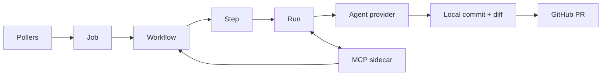

# Architecture

This page is the short map. The canonical deep dive lives in
[`ARCHITECTURE.md`](https://github.com/tkadauke/syrus/blob/main/ARCHITECTURE.md),
with planning detail in
[`ROADMAP.md`](https://github.com/tkadauke/syrus/blob/main/ROADMAP.md).

## Overview



Pollers watch GitHub issues, pull requests, rebases, CI failures, and
scheduled tasks. A trigger creates or updates a Job. Each attempt on that
Job is a Workflow, each Workflow is a chain of Steps, and each Step has a
Run that performs the work and records transcript, cost, diff, and session
metadata.

## Why Polling

Syrus uses external polling instead of inbound GitHub callbacks so a self-hosted instance
does not need a public inbound HTTP endpoint. That keeps the deployment
story simple for homelabs, private clusters, and small teams behind NAT.
The trade-off is that reactions happen on poll cadence rather than at
callback speed, but the architecture stays portable and avoids exposing the
operator's network.

## MCP Sidecar

Agentic Steps launch the configured provider with an MCP config that starts
`bin/syrus-mcp-sidecar` over stdio. The sidecar exposes a small tool
surface, currently centered on `submit_summary(pr_title, pr_body, summary)`.
When the agent calls it, the sidecar writes structured artifacts onto the
Workflow and appends an audit log line. Later Steps consume those artifacts:
`pr_open` reads PR copy, and `summarize_amend` provides follow-up commit
messages. The tool name and sidecar binary name intentionally match so
the provider can invoke the registered MCP tool.

## Credential Encryption

Each user's GitHub and agent credentials are stored as Active Record
encrypted attributes. The database holds ciphertext; production deploys
should provide stable `ACTIVE_RECORD_ENCRYPTION_*` environment variables
for any web, worker, or console process that touches users. If those
variables are absent, Rails falls back to credentials, so
`RAILS_MASTER_KEY` must be stable instead. Push credentials are also kept
off disk: clone remotes use anonymous GitHub URLs, and Syrus constructs a
token-bearing URL only for the individual push command.

## MVP Trust Boundary

The MVP assumes trusted users and trusted repositories. Agent commands run in
worker-managed workspaces outside the Syrus checkout, but those workspaces
are not hardened untrusted-code sandboxes. Register repositories whose setup
commands you are willing to execute, scope GitHub tokens narrowly, and
review generated PRs before merging.

## State Machines

Jobs are long-lived threads around an issue, scheduled task, or direct
prompt:

```text
Job: open <-> closed
```

Workflows are attempts on a Job:

```text
Workflow: queued -> running -> succeeded
                         |-> failed
                         |-> cancelled
             failed -> running  (retry from failed step)
```

Steps are nodes inside a Workflow:

```text
Step: queued -> running -> succeeded
                    |-> failed
                    |-> cancelled
       failed -> queued  (step retry)
```

Runs are attempts to execute a Step:

```text
Run: queued -> running -> succeeded
                   |-> failed
                   |-> cancelled
```

Terminal Workflow transitions own workspace cleanup. Successful and
cancelled Workflows clean up immediately; failed Workflows keep their
workspace for retry until the prune job removes old terminal workspaces.

## Core Files

| Area | Files |
| --- | --- |
| Orchestration | [`app/jobs/run_job.rb`](https://github.com/tkadauke/syrus/blob/main/app/jobs/run_job.rb), [`app/services/step_dispatcher.rb`](https://github.com/tkadauke/syrus/blob/main/app/services/step_dispatcher.rb) |
| Workflow templates | [`app/services/workflows/`](https://github.com/tkadauke/syrus/tree/main/app/services/workflows) |
| Step handlers | [`app/services/steps/`](https://github.com/tkadauke/syrus/tree/main/app/services/steps) |
| Workspaces | [`app/services/workflow_workspace.rb`](https://github.com/tkadauke/syrus/blob/main/app/services/workflow_workspace.rb) |
| Agent providers | [`app/services/agent_providers/`](https://github.com/tkadauke/syrus/tree/main/app/services/agent_providers) |
| MCP sidecar | [`app/services/syrus_mcp/`](https://github.com/tkadauke/syrus/tree/main/app/services/syrus_mcp), [`bin/syrus-mcp-sidecar`](https://github.com/tkadauke/syrus/blob/main/bin/syrus-mcp-sidecar) |
| Pollers | [`app/jobs/poll_all_repositories_job.rb`](https://github.com/tkadauke/syrus/blob/main/app/jobs/poll_all_repositories_job.rb), [`app/jobs/poll_pull_request_job.rb`](https://github.com/tkadauke/syrus/blob/main/app/jobs/poll_pull_request_job.rb), [`app/jobs/poll_rebase_job.rb`](https://github.com/tkadauke/syrus/blob/main/app/jobs/poll_rebase_job.rb), [`app/jobs/poll_scheduled_tasks_job.rb`](https://github.com/tkadauke/syrus/blob/main/app/jobs/poll_scheduled_tasks_job.rb) |
